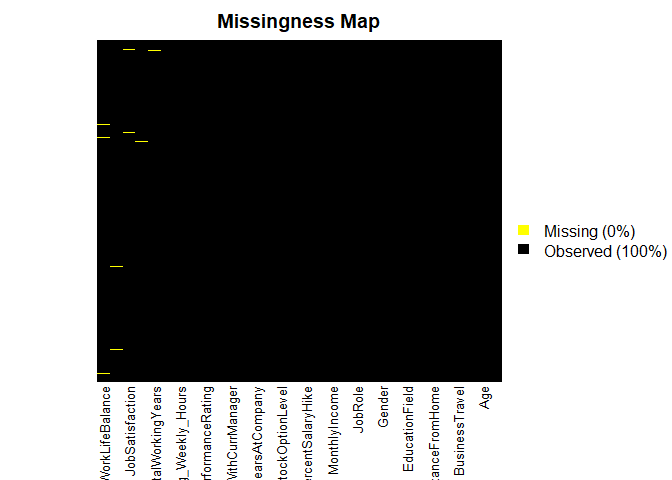
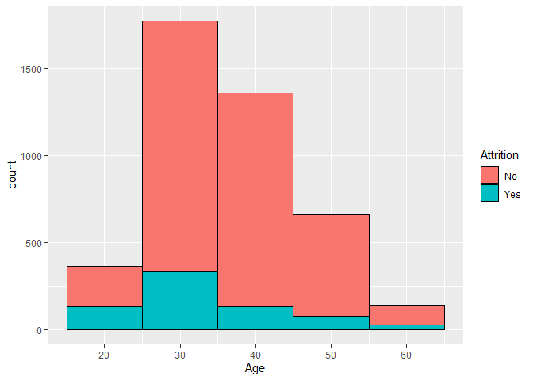
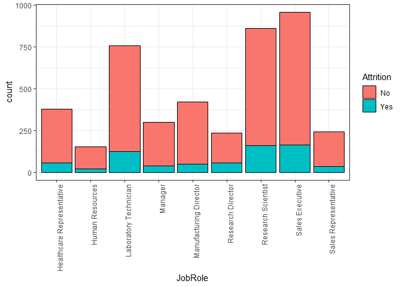
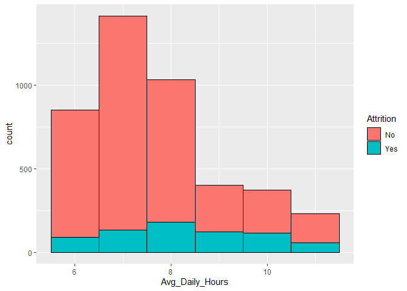
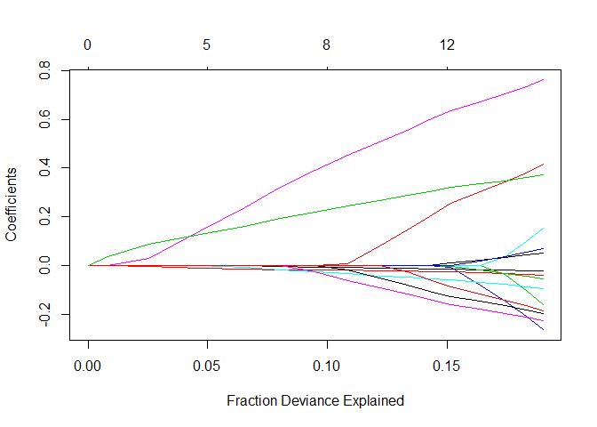
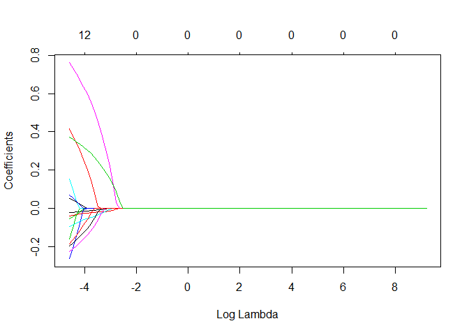
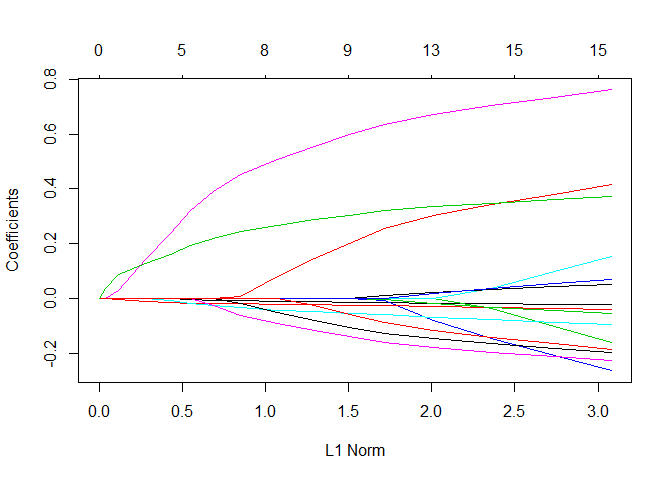
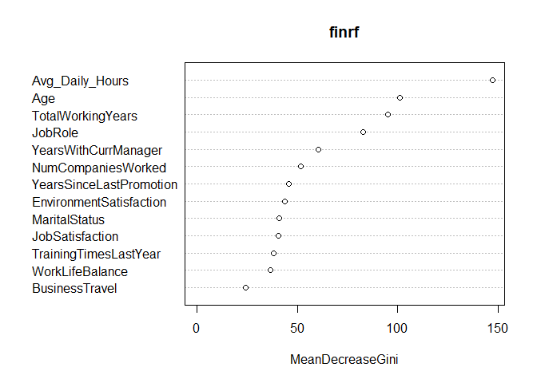

    library(dplyr)
    library(tidyr)
    library(ggplot2)
    library(Amelia)

    #read in merged data, created by conmbining several spreadsheets
    Master_Data <- read.csv("master.csv")

    ##CLEAN DATA

    #Missing Data Map
    missmap(Master_Data,y.at=c(1),y.labels = c(''),col=c('yellow','black'))

    #Very few rows with missing data - omit
    Master_Data <- na.omit(Master_Data)

    #Remove columns we dont need in our analysis
    Master_Data$StandardHours <- NULL
    Master_Data$Over18 <- NULL
    Master_Data$EmployeeCount <- NULL
    Master_Data$EmployeeID <- NULL

Exploratory Data Analysis
=========================

    ggplot(Master_Data,aes(Age)) + 
        geom_histogram(aes(fill=Attrition),color='black',binwidth=10) 

    ggplot(Master_Data,aes(JobRole)) +
      geom_bar(aes(fill = Attrition),color = 'black') +
      theme_bw() + theme(axis.text.x = element_text(angle = 90, hjust = 1))

    ggplot(Master_Data,aes(Avg_Daily_Hours)) + 
        geom_histogram(aes(fill=Attrition),color='black',binwidth=1) 

Logistic Regression Prediction:
===============================

    ##SPLIT DATA
    library(caTools)
    set.seed(1)
    sample <- sample.split(Master_Data$Attrition,SplitRatio = 0.7)
    #Training Data
    train <- subset(Master_Data,sample==T)
    #Testing Data
    test <- subset(Master_Data,sample==F)

    ##TRAIN THE LOGISTIC REGRESSION MODEL
    logModel <- glm(Attrition ~., family = binomial('logit'),data = train)
    summary(logModel)

    ## 
    ## Call:
    ## glm(formula = Attrition ~ ., family = binomial("logit"), data = train)
    ## 
    ## Deviance Residuals: 
    ##     Min       1Q   Median       3Q      Max  
    ## -1.8609  -0.5653  -0.3310  -0.1488   3.7148  
    ## 
    ## Coefficients:
    ##                                    Estimate Std. Error z value Pr(>|z|)
    ## (Intercept)                       6.481e-01  1.129e+00   0.574  0.56600
    ## Age                              -3.679e-02  9.059e-03  -4.062 4.88e-05
    ## BusinessTravelTravel_Frequently   1.394e+00  2.616e-01   5.330 9.81e-08
    ## BusinessTravelTravel_Rarely       6.916e-01  2.423e-01   2.855  0.00431
    ## DepartmentResearch & Development -8.725e-01  3.283e-01  -2.658  0.00787
    ## DepartmentSales                  -9.884e-01  3.456e-01  -2.860  0.00423
    ## DistanceFromHome                  2.989e-03  7.174e-03   0.417  0.67693
    ## Education                        -6.062e-02  5.649e-02  -1.073  0.28322
    ## EducationFieldLife Sciences      -5.450e-01  4.657e-01  -1.170  0.24183
    ## EducationFieldMarketing          -6.553e-01  5.107e-01  -1.283  0.19945
    ## EducationFieldMedical            -6.252e-01  4.648e-01  -1.345  0.17862
    ## EducationFieldOther              -6.641e-01  5.216e-01  -1.273  0.20289
    ## EducationFieldTechnical Degree   -6.937e-01  4.938e-01  -1.405  0.16004
    ## GenderMale                        1.805e-01  1.194e-01   1.511  0.13072
    ## JobLevel                         -4.245e-02  5.227e-02  -0.812  0.41679
    ## JobRoleHuman Resources           -1.267e-01  3.648e-01  -0.347  0.72840
    ## JobRoleLaboratory Technician      1.766e-01  2.331e-01   0.758  0.44863
    ## JobRoleManager                   -5.539e-01  3.263e-01  -1.698  0.08959
    ## JobRoleManufacturing Director    -6.370e-01  2.842e-01  -2.241  0.02503
    ## JobRoleResearch Director          6.957e-01  3.017e-01   2.306  0.02111
    ## JobRoleResearch Scientist         8.511e-02  2.297e-01   0.370  0.71104
    ## JobRoleSales Executive            2.260e-01  2.271e-01   0.995  0.31977
    ## JobRoleSales Representative       2.934e-02  2.966e-01   0.099  0.92122
    ## MaritalStatusMarried              1.788e-01  1.705e-01   1.049  0.29425
    ## MaritalStatusSingle               1.134e+00  1.705e-01   6.653 2.87e-11
    ## MonthlyIncome                    -2.037e-07  1.254e-06  -0.162  0.87093
    ## NumCompaniesWorked                1.469e-01  2.517e-02   5.837 5.32e-09
    ## PercentSalaryHike                 1.038e-02  2.475e-02   0.419  0.67511
    ## StockOptionLevel                 -8.801e-03  6.801e-02  -0.129  0.89703
    ## TotalWorkingYears                -9.679e-02  1.701e-02  -5.690 1.27e-08
    ## TrainingTimesLastYear            -1.333e-01  4.584e-02  -2.909  0.00362
    ## YearsAtCompany                    5.881e-02  2.427e-02   2.423  0.01539
    ## YearsSinceLastPromotion           1.771e-01  2.660e-02   6.659 2.77e-11
    ## YearsWithCurrManager             -2.019e-01  3.011e-02  -6.704 2.02e-11
    ## EnvironmentSatisfaction          -3.671e-01  5.208e-02  -7.049 1.81e-12
    ## JobSatisfaction                  -3.349e-01  5.266e-02  -6.360 2.02e-10
    ## WorkLifeBalance                  -3.912e-01  7.784e-02  -5.026 5.01e-07
    ## JobInvolvement                   -6.500e-02  7.963e-02  -0.816  0.41437
    ## PerformanceRating                -4.743e-02  2.470e-01  -0.192  0.84776
    ## Avg_Daily_Hours                   1.995e+00  1.532e+00   1.302  0.19279
    ## Avg_Weekly_Hours                 -3.340e-01  3.358e-01  -0.995  0.31995
    ## Days_off                         -4.706e-02  5.307e-02  -0.887  0.37523
    ##                                     
    ## (Intercept)                         
    ## Age                              ***
    ## BusinessTravelTravel_Frequently  ***
    ## BusinessTravelTravel_Rarely      ** 
    ## DepartmentResearch & Development ** 
    ## DepartmentSales                  ** 
    ## DistanceFromHome                    
    ## Education                           
    ## EducationFieldLife Sciences         
    ## EducationFieldMarketing             
    ## EducationFieldMedical               
    ## EducationFieldOther                 
    ## EducationFieldTechnical Degree      
    ## GenderMale                          
    ## JobLevel                            
    ## JobRoleHuman Resources              
    ## JobRoleLaboratory Technician        
    ## JobRoleManager                   .  
    ## JobRoleManufacturing Director    *  
    ## JobRoleResearch Director         *  
    ## JobRoleResearch Scientist           
    ## JobRoleSales Executive              
    ## JobRoleSales Representative         
    ## MaritalStatusMarried                
    ## MaritalStatusSingle              ***
    ## MonthlyIncome                       
    ## NumCompaniesWorked               ***
    ## PercentSalaryHike                   
    ## StockOptionLevel                    
    ## TotalWorkingYears                ***
    ## TrainingTimesLastYear            ** 
    ## YearsAtCompany                   *  
    ## YearsSinceLastPromotion          ***
    ## YearsWithCurrManager             ***
    ## EnvironmentSatisfaction          ***
    ## JobSatisfaction                  ***
    ## WorkLifeBalance                  ***
    ## JobInvolvement                      
    ## PerformanceRating                   
    ## Avg_Daily_Hours                     
    ## Avg_Weekly_Hours                    
    ## Days_off                            
    ## ---
    ## Signif. codes:  0 '***' 0.001 '**' 0.01 '*' 0.05 '.' 0.1 ' ' 1
    ## 
    ## (Dispersion parameter for binomial family taken to be 1)
    ## 
    ##     Null deviance: 2661.4  on 3009  degrees of freedom
    ## Residual deviance: 2034.4  on 2968  degrees of freedom
    ## AIC: 2118.4
    ## 
    ## Number of Fisher Scoring iterations: 6

    ##PREDICTIONS
    pred_probabilities <- predict(logModel,test,type = 'response')
    pred_results <- ifelse(pred_probabilities>0.5,1,0)
    #Convert Attrition column in test to 0s and 1s to compare to pred_results
    test$AttritionClass <- ifelse(test$Attrition == 'Yes',1,0)
    misClassError <- mean(pred_results != test$AttritionClass)
    accuracy <- (1-misClassError)
    cat("Misclassification error:", misClassError, "\n")

    ## Misclassification error: 0.1457364

    cat("Accuracy:", accuracy, "\n")

    ## Accuracy: 0.8542636

    #Confusion matrix for Logistic Regression Model
    cm_log = table(test$AttritionClass, pred_results)
    cm_log

    ##    pred_results
    ##        0    1
    ##   0 1043   38
    ##   1  150   59

    cat(100 * cm_log[2, 2]/(cm_log[1, 2] + cm_log[2, 2]), "% of the people who predicted to leave the company actually left.\n")

    ## 60.82474 % of the people who predicted to leave the company actually left.

    cat(100 * cm_log[1, 1]/(cm_log[1, 1] + cm_log[2, 1]), "% of the people who predicted to stay with the company actually stayed.")

    ## 87.42666 % of the people who predicted to stay with the company actually stayed.

LASSO Regression Prediction:
============================

    #LASSO to determine variables to include
    library(glmnet)

    ## Warning: package 'glmnet' was built under R version 3.6.1

    ## Loading required package: Matrix

    ## 
    ## Attaching package: 'Matrix'

    ## The following object is masked from 'package:tidyr':
    ## 
    ##     expand

    ## Loading required package: foreach

    ## Loaded glmnet 2.0-18

    trainMatrix <- model.matrix(Attrition ~ ., data = train)
    testMatrix <- model.matrix(Attrition ~ ., data = test)
    grid <- 10 ^ seq(4, -2, length = 100)
    lasso <- glmnet(trainMatrix, train$Attrition, alpha = 1, lambda = grid, thresh = 1e-12, family = "binomial")
    lassoCV <- cv.glmnet(trainMatrix, train$Attrition, alpha = 1, lambda = grid, thresh = 1e-12, family = "binomial")
    lassoLambdaMin <- lassoCV$lambda.min
    predict(lasso, s = lassoLambdaMin, type = "coefficients")

    ## 43 x 1 sparse Matrix of class "dgCMatrix"
    ##                                            1
    ## (Intercept)                      -1.78129932
    ## (Intercept)                       .         
    ## Age                              -0.02386590
    ## BusinessTravelTravel_Frequently   0.41497048
    ## BusinessTravelTravel_Rarely       .         
    ## DepartmentResearch & Development  .         
    ## DepartmentSales                   .         
    ## DistanceFromHome                  .         
    ## Education                         .         
    ## EducationFieldLife Sciences       .         
    ## EducationFieldMarketing           .         
    ## EducationFieldMedical             .         
    ## EducationFieldOther               .         
    ## EducationFieldTechnical Degree    .         
    ## GenderMale                        .         
    ## JobLevel                          .         
    ## JobRoleHuman Resources            .         
    ## JobRoleLaboratory Technician      .         
    ## JobRoleManager                   -0.16098795
    ## JobRoleManufacturing Director    -0.26519747
    ## JobRoleResearch Director          0.15305345
    ## JobRoleResearch Scientist         .         
    ## JobRoleSales Executive            .         
    ## JobRoleSales Representative       .         
    ## MaritalStatusMarried              .         
    ## MaritalStatusSingle               0.76126536
    ## MonthlyIncome                     .         
    ## NumCompaniesWorked                0.05067720
    ## PercentSalaryHike                 .         
    ## StockOptionLevel                  .         
    ## TotalWorkingYears                -0.04246282
    ## TrainingTimesLastYear            -0.05622341
    ## YearsAtCompany                    .         
    ## YearsSinceLastPromotion           0.06909769
    ## YearsWithCurrManager             -0.09518904
    ## EnvironmentSatisfaction          -0.22869074
    ## JobSatisfaction                  -0.19877276
    ## WorkLifeBalance                  -0.18575042
    ## JobInvolvement                    .         
    ## PerformanceRating                 .         
    ## Avg_Daily_Hours                   0.37250976
    ## Avg_Weekly_Hours                  .         
    ## Days_off                          .

    testMatrix = testMatrix[,-43]

    pred_probabilitiesLASSO <- predict(lasso, s = lassoLambdaMin, type = "response", newx = testMatrix)
    pred_resultsLASSO <- ifelse(pred_probabilitiesLASSO>0.5,1,0)
    #Convert Attrition column in test to 0s and 1s to compare to pred_results
    #test$AttritionClass <- ifelse(test$Attrition == 'Yes',1,0)
    misClassErrorLASSO <- mean(pred_resultsLASSO != test$AttritionClass)
    accuracyLASSO <- (1-misClassErrorLASSO)
    cat("Misclassification error:", misClassErrorLASSO, "\n")

    ## Misclassification error: 0.1457364

    cat("Accuracy:", accuracyLASSO, "\n")

    ## Accuracy: 0.8542636

    #Confusion matrix for LASSO Regression Model
    cm_LASSO = table(test$AttritionClass, pred_resultsLASSO)
    cm_LASSO

    ##    pred_resultsLASSO
    ##        0    1
    ##   0 1075    6
    ##   1  182   27

    cat(100 * cm_LASSO[2, 2]/(cm_LASSO[1, 2] + cm_LASSO[2, 2]), "% of the people who predicted to leave the company actually left.\n")

    ## 81.81818 % of the people who predicted to leave the company actually left.

    cat(100 * cm_LASSO[1, 1]/(cm_LASSO[1, 1] + cm_LASSO[2, 1]), "% of the people who predicted to stay with the company actually stayed.")

    ## 85.52108 % of the people who predicted to stay with the company actually stayed.

Interestingly, LASSO Regression yielded the exact same misclassification
error and accuracy as the Logistic Regression model. However, the
confusion matrix elements between the two are different. The LASSO model
does a much better job at predicting the people that would actually
leave the company. It does so at the expense of lower prediction
accuracy of those that would stay at the company.

    plot(lasso, xvar = "dev")

    ## Warning in regularize.values(x, y, ties, missing(ties)): collapsing to
    ## unique 'x' values

    plot(lasso, xvar = "lambda")

    plot(lasso, xvar = "norm")

    ## Warning in regularize.values(x, y, ties, missing(ties)): collapsing to
    ## unique 'x' values

Random Forest prediction using significant variables identified by LASSO:
=========================================================================

    library(randomForest)

    ## randomForest 4.6-14

    ## Type rfNews() to see new features/changes/bug fixes.

    ## 
    ## Attaching package: 'randomForest'

    ## The following object is masked from 'package:ggplot2':
    ## 
    ##     margin

    ## The following object is masked from 'package:dplyr':
    ## 
    ##     combine

    set.seed(1)
    #Drop the variables whose coefficients = 0 in LASSO
    #Produces a simpler model without compromising accuracy.
    Master_Data <- Master_Data[,-c(4,5,6,7,8,9,12,14,15,18,24,25,27,28)]
    sample <- sample.split(Master_Data$Attrition,SplitRatio = 0.7)
    #Training Data
    train <- subset(Master_Data,sample==T)
    #Testing Data
    test <- subset(Master_Data,sample==F)
    set.seed(1)
    finrf = randomForest(Attrition~.,data=train,ntree=500)
    finrfpred=predict(finrf,newdata=test)
    cat("Misclassification error:", sum(abs(as.numeric(test$Attrition)-as.numeric(finrfpred)))/nrow(test))

    ## Misclassification error: 0.02170543

    finrfrmse = sqrt(sum((as.numeric(test$Attrition)-as.numeric(finrfpred))^2)/nrow(test))
    varImpPlot(finrf)

Avg\_Daily\_Hours, Age, TotalWorkingYears, and JobRole are the most
significant variables in predicting attrition.

    #Confusion matrix for Random Forest Model
    cm_rf = table(test$Attrition, finrfpred)
    cm_rf

    ##      finrfpred
    ##         No  Yes
    ##   No  1075    6
    ##   Yes   22  187

    cat(100 * cm_rf[2, 2]/(cm_rf[1, 2] + cm_rf[2, 2]), "% of the people who predicted to leave the company actually left.\n")

    ## 96.89119 % of the people who predicted to leave the company actually left.

    cat(100 * cm_rf[1, 1]/(cm_rf[1, 1] + cm_rf[2, 1]), "% of the people who predicted to stay with the company actually stayed.")

    ## 97.99453 % of the people who predicted to stay with the company actually stayed.

Model Performance Evaluation
============================

Comparing the three different models that were developed, the Random
Forest model built off of the LASSO variables comes out on top. This
model produced the highest prediction accuracy (.978), while minimizing
the occurrence of obtaining a false positive or negative. In fact, the
Random Forest model reduced the occurrence of a false negative by a
factor of 10 from the original Logistic (.39 vs .031). Assessing out of
sample misclassification error, we see that LASSO and Logistic produce
the same value of .15. However, if prompted to select the better model
out of the two, we would suggest using LASSO. This model reduces
complexity by zeroing out many of the variables in addition to cutting
the occurrence of a false negative by half (.39 to .18).
